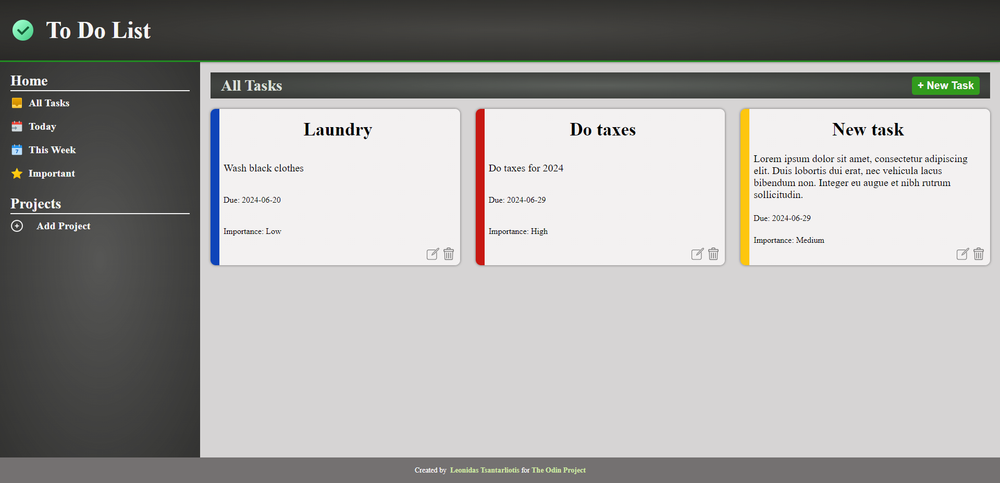

# To-Do-List

Live Demo:  
https://leo-tsant.github.io/to-do-list/

## Overview

This project was created for the [Todo List assignment](https://www.theodinproject.com/lessons/node-path-javascript-todo-list) as part of [The Odin Project](https://www.theodinproject.com/) curriculum. The goal of the project was to practice DOM manipulation, event handling, and local storage to create an interactive task management tool.

## Technologies Used

-   **HTML**
-   **CSS**
-   **JavaScript (ES6+)**
-   **Webpack**
